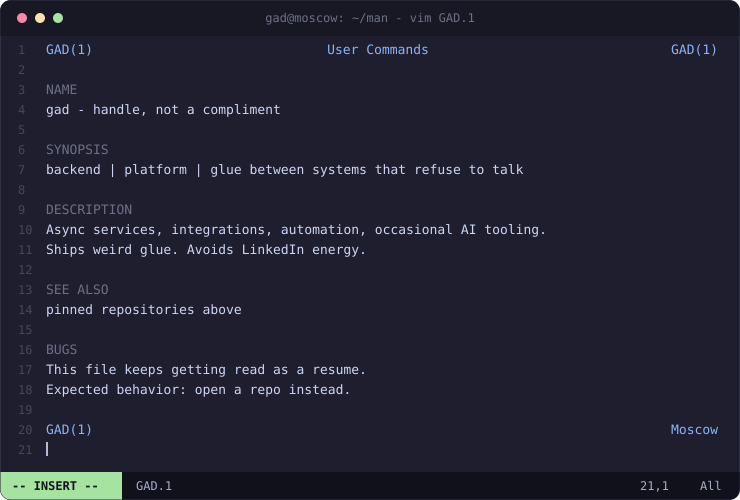

# GAD

<p align="left">
  
</p>

```
GAD(1)                     User Commands                    GAD(1)

NAME
    gad — handle, not a compliment

SYNOPSIS
    backend | platform | glue between systems that refuse to talk

DESCRIPTION
    Async services, integrations, automation, occasional AI tooling.
    Ships weird glue. Avoids LinkedIn energy.

SEE ALSO
    pinned repositories above

BUGS
    This file keeps getting read as a resume.
    Expected behavior: open a repo instead.

GAD(1)                                                          Moscow
```
